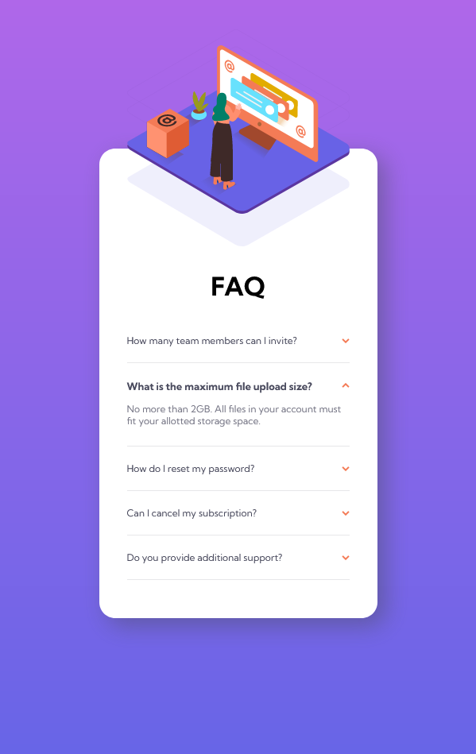

# Frontend Mentor - FAQ accordion card solution

This is a solution to the [FAQ accordion card challenge on Frontend Mentor](https://www.frontendmentor.io/challenges/faq-accordion-card-XlyjD0Oam). Frontend Mentor challenges help you improve your coding skills by building realistic projects.

## Table of contents

- [Overview](#overview)
  - [The challenge](#the-challenge)
  - [Screenshot](#screenshot)
- [My process](#my-process)
  - [Built with](#built-with)
  - [What I learned](#what-i-learned)
- [Author](#author)

## Overview

### The challenge

Users should be able to:

- View the optimal layout for the component depending on their device's screen size
- See hover states for all interactive elements on the page
- Hide/Show the answer to a question when the question is clicked

### Screenshot




## My process

### Built with

- Semantic HTML5 markup
- CSS custom properties
- Flexbox
- JS
- jQuery

### What I learned

I struggled a little bit positioning the images until I found out how "overflow" actually works. I ended up really proud of my final solution.

```css
.container_left {
  position: relative;
  width: 50%;
  overflow: hidden;
  /* overflow goes into the parent div */
}

.container_left_bg-pattern {
  position: absolute;
  right: 15%;
  bottom: -30%;
}

.container_left_wo-image {
  position: absolute;
  left: -19%;
  top: 12%;
}
```

## Author

- Website - [Oda Solà López](https://osolaldev.github.io/Personal-Site-English/)
- Frontend Mentor - [@OdaSolaDev](https://www.frontendmentor.io/profile/OdaSolaDev)
